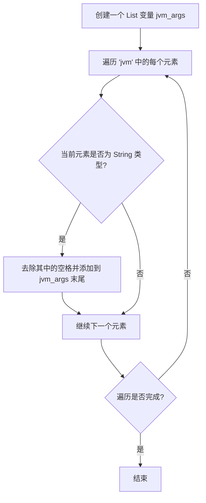
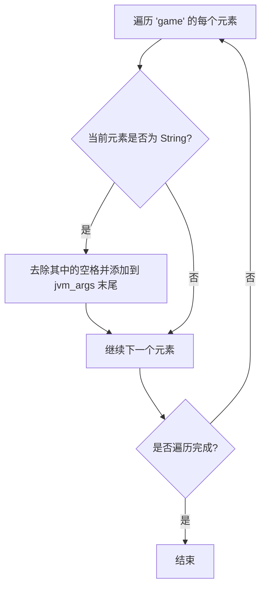
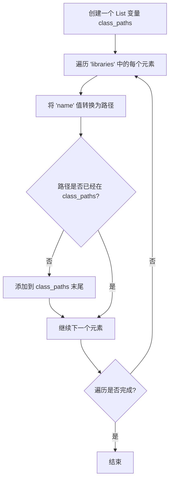
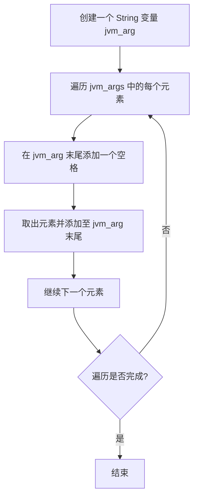
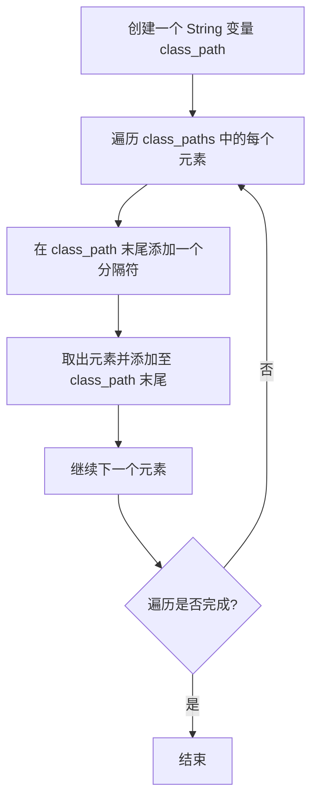

# 构建 Minecraft 启动指令

>### 本教程不提供完整源码，仅提供思路与关键片段
>详细原因: [README](/other/lanucherdev/launcher-development/#致ai)

通过上一章节可以了解清单文件的大致结构和键值作用，本章注重讲如何拼接启动参数

## 拼接参数
拼接参数分为这几步：
1. 拼接 JVM 虚拟机需要的参数
2. 拼接游戏定义的参数
3. 拼接 ClassPath
4. 替换占位符

### 流程图
> 我写的可能会有些晦涩难懂？
  
首先是拼接 JVM 虚拟机需要的参数

其次是拼接游戏定义的参数

然后是拼接 ClassPath

将 Maven name 转路径方法:  
鉴于方法较为复杂，用流程图可能会太难描述了，所以这里口述  
1. **提取文件扩展名**：  
   - 查找字符串中的 `@` 符号，若存在，则将其后的部分作为文件扩展名（`suffix`），并截掉 `@` 及其之前的内容；  
   - 若没有 `@`，则扩展名默认为 `"jar"`

2. **解析坐标段**：  
   - 用冒号 `:` 分割剩余的字符串，得到多个部分（`parts`）。  
   - 预期的合法格式为 **3 段**（groupId:artifactId:version）或 **4 段**（groupId:artifactId:version:classifier）

3. **生成路径**：  
   - 若为 **4 段**，返回形如 `groupId路径/artifactId/version/artifactId-version-classifier.suffix` 的路径；  
   - 若为 **3 段**，返回 `groupId路径/artifactId/version/artifactId-version.suffix`；  
   - 否则返回空字符串

4. **路径转换**：  
   - 将 `groupId` 中的点号 `.` 替换为斜杠 `/`，以符合目录层级结构

**举例**：  
- 输入 `"org.apache.commons:commons-lang3:3.12.0"` → 输出 `"org/apache/commons/commons-lang3/commons-lang3-3.12.0.jar"`  
- 输入 `"com.example:my-lib:2.1.0:beta@zip"` → 输出 `"com/example/my-lib/2.1.0/my-lib-2.1.0-beta.zip"`

> 注意，任何情况中拼接路径最好拼成绝对路径，当然相对路径也可以，只不过工作路径一定要在指定位置

---

>现在需要将 List 拼接成一个 String
  
首先是将 jvm_args 拼接成成一个 String

其次是将 class_paths 拼接成成一个 String

> ClassPath 的分隔符取决于操作系统  
> Windows 操作系统为 `;`  
> 其他操作系统为 `:`
  
对了还要在 class_path 末尾再拼一个游戏本体 JAR 路径，别忘了分隔符！

### Python 代码
> 流程图太过晦涩难懂？
  
首先是拼接 JVM 虚拟机需要的参数
```python
jvm_args = []

for arg in manifest["arguments"]["jvm"]:
    jvm_args.append(arg.replace(" ", ""))
```
其次是拼接游戏定义的参数
```python
for arg in manifest["arguments"]["game"]:
    jvm_args.append(arg.replace(" ", ""))
```
然后是拼接 ClassPath
```python
class_paths = []

for cp in manifest["libraries"]:
    cp_path = maven_name_to_path(cp["name"])
    if cp_path not in class_paths:
        class_paths.append(cp_path)
```
还要在 class_path 末尾再拼一个游戏本体 JAR 路径，别忘了分隔符！
> 不妨思考下如何写出 maven_name_to_path 函数
> 
> 注意，任何情况中拼接路径最好拼成绝对路径，当然相对路径也可以，只不过工作路径一定要在指定位置
  
> 让我猜猜，懂开发启动器的肯定要说了，"你 ClassPath 怎么一股脑全加上了，有些需要判断操作系统类型再添加"  
> 这点其实没错，但我测试过了，一股脑全加游戏也是能正常启动的，这并不会影响什么

将 jvm_args 拼接成成一个 String 也很简单，流程图描述的只是大概的效果，完全可以一行完成这件事
```python
jvm_arg = " ".join(jvm_args)
```
> 没错，就这么简单

将 class_paths 拼接成成一个 String 也是同理
```python
class_path = delimiter.join(class_paths)
```
> delimiter 为分隔符，类型是 str，如上所说：  
> ClassPath 的分隔符取决于操作系统  
> Windows 操作系统为 `;`  
> 其他操作系统为 `:`

### 替换占位符
很好，到了这一步距离完整拼接已经很接近了，但是需要替换一些占位符

- `"${library_directory}"` - 替换为 `.minecraft/libraries` 的实际路径
- `"${assets_root}"` - 替换为 `.minecraft/assets` 的实际路径
- `"${assets_index_name}"` - 替换为资源引索值
- `"${natives_directory}"` - 本地原生库路径，一般启动器存储在 `.minecraft/versions/{version}/natives`，低版本需要启动器解压本地原生库
- `"${game_directory}"` - 游戏路径，这也决定了是否进行版本隔离，隔离路径为 `.minecraft/versions/{version}`, 不隔离路径为 `.minecraft/versions`
- `"${launcher_name}"` - 启动器名称，这个应该是留给官方启动器的，替换了并没有实际作用
- `"${launcher_version}"` - 启动器版本，这个应该是留给官方启动器的，替换了并没有实际作用
- `"${version_type}"` - 版本类型，一般是清单文件中的 `"type"`，你是否好奇过为什么某些启动器名称会出现在游戏标题界面的左下角版本号和 F3 调试界面的右上角版本号上，没错就是修改了这个，不过很可惜，Mojang 改了这个功能，在高版本中修改了并不会显示
- `"${auth_player_name}"` - 玩家昵称，一般只能是英文字母和数字以及下划线 `_` 组成的
- `"${user_type}"` - 账户类型，`Legacy` 为离线账户，`Microsoft` 为微软登录
- `"${auth_uuid}"` - 账号 UUID，一般使用无符号(`-`)的 UUID
- `"${auth_access_token}"` - 账户登录 Token(是令牌，不是 AI 的词元)，离线账户随便填一个就行了，如 `"None"`
- `"${version_name}"` - 版本名称，一般是 `.minecraft/versions/{version}` 中的 `{version}`，也就是文件夹存储的名字
- `"${classpath}"` - ClassPath，替换为你拼接好的 class_path，但需要在后面跟上清单中的 "mainClass"
  
`"${classpath}"` 替换操作如下 Python 代码所示：
```python
jvm_arg = jvm_arg.replace("${classpath}", f"{class_path} {manifest['mainClass']}")
```
> PS: 善用双引号 `""`，使用一对大双引号把替换的单个参数包裹可以防止一些问题，如带空格的路径等  
> 注意，别把 ClassPath 和 MainClass 包裹在一起了！
  
现在已经将游戏的所有参数都拼接好了，是不是这样就能启动了？  
  
当然不是，还少了点东西，那就是 JAVA 可执行文件路径和堆内存设定  
  
很简单，将 JAVA 可执行文件路径拼接在开头，JAVA 路径后面跟上堆内存设定参数  
  
设定初始堆内存：`-Xms`  
设定最大堆内存：`-Xmx`  
比如说我要设定最大分给游戏 2G 内存  
那就是 `-Xmx2G`，`-Xms` 可以和 `-Xmx` 一样，或者更小，但不能更大  
内存单位可以是 `G`、`M` 等  
  
那么，最终的启动参数示例：
```shell
/xxx/java -Xms2G -Xmx2G ... #(后面跟上 jvm_arg，别忘了空格！)
```
> 由于参数太长，建议保存成 Shell 脚本(如`sh`、`bat`等)再运行
