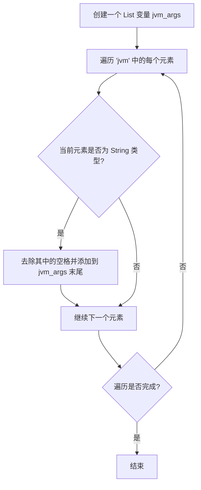
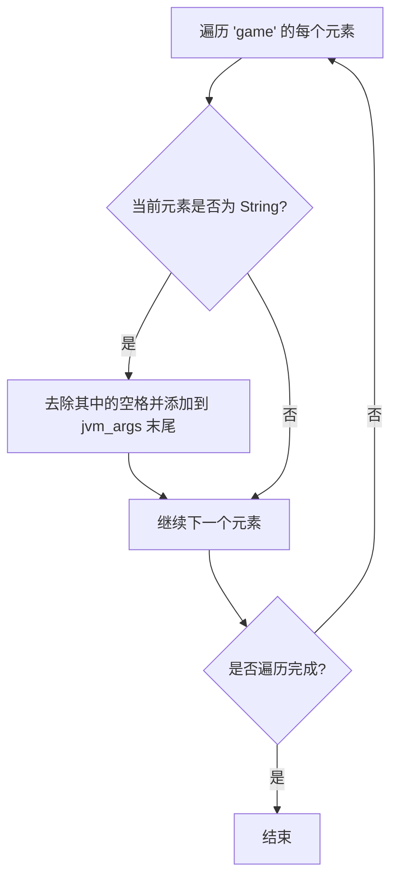
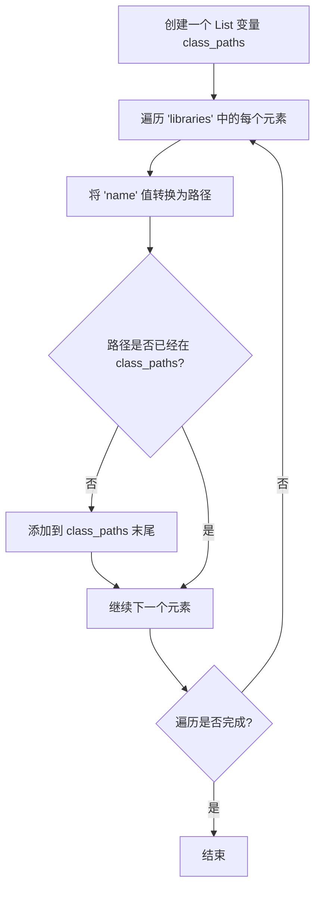
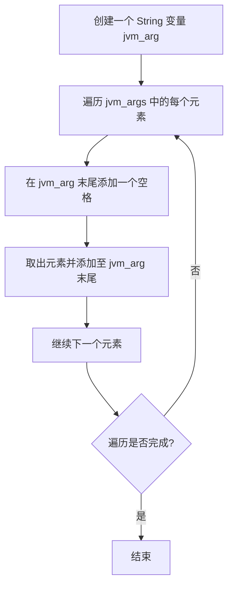
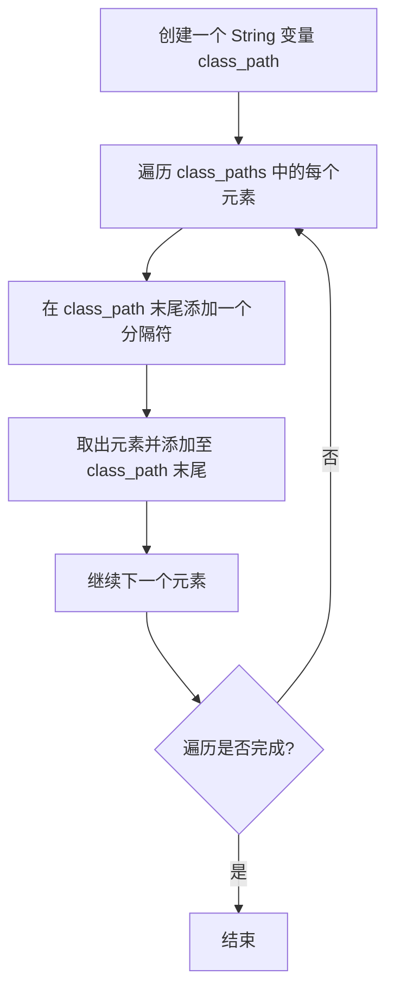

::: info
本教程不提供完整源码，仅提供思路与关键片段
详细原因: [点击此处](/other/lanucherdev/introduction/#致ai)
:::

通过上一章节可以了解清单文件的大致结构和键值作用，本章注重讲如何拼接启动参数

## 拼接参数
拼接参数分为这几步：
1. 拼接 JVM 虚拟机需要的参数
2. 拼接游戏定义的参数
3. 拼接 Classpath
4. 替换占位符

### 流程图
> 我写的可能会有些晦涩难懂？
  
首先是拼接 JVM 虚拟机需要的参数  

其次是拼接游戏定义的参数

然后是拼接 Classpath

>现在需要将 List 拼接成一个 String
  
首先是将 jvm_args 拼接成成一个 String

其次是将 class_paths 拼接成成一个 String

> Classpath 的分隔符取决于操作系统  
> Windows 操作系统为 `;`  
> 其他操作系统为 `:`

### Python 代码
> 流程图太过晦涩难懂？
